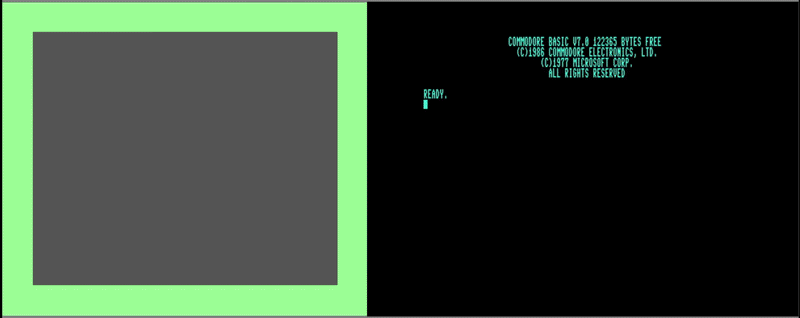

# dual80-for-c128
Extended screens demo with 80 columns total across both screens

The regular 40-column screen (VIC-II) is on the left, and normally 80-column screen (VDC) is on the right, but reconfigured to 40 columns and IRQ copies what KERNAL stores there to the VIC-II screen in 5 line increments every 1/60 second when VDC not busy, so at most 12FPS

Instructions: be sure to press 80 column button down and boot your C128/C128D with disk in drive

Supports: NTSC/PAL, 8563(ver.1)/8568(ver.2), orig. C128, and C128D, 16K VDC RAM, 64K VDC RAM (does not use extra RAM)

Download: [D64 disk image](https://github.com/davervw/dual80-for-c128/raw/refs/heads/main/80dual.d64)
